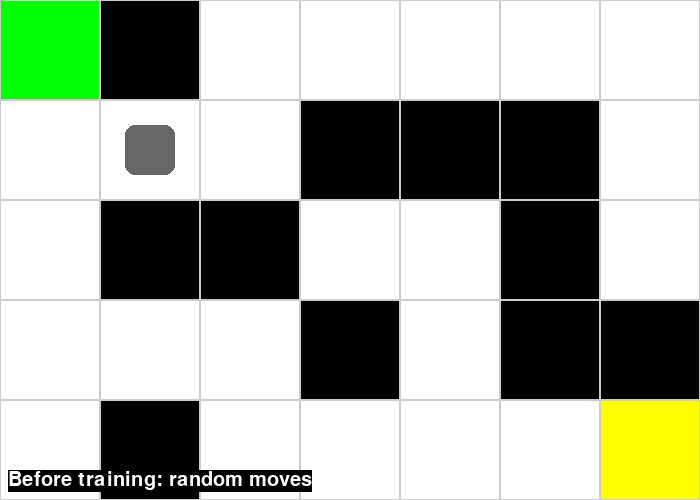
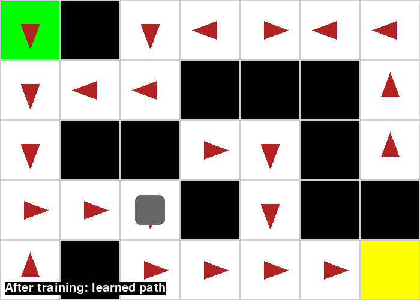

# 🐭 AI Smart Mouse: A Q-Learning Maze Solver

[](https://opensource.org/licenses/MIT)


A small, visual reinforcement-learning project. A mouse starts with zero knowledge of a maze and learns, by trial and error with **Q-learning**, the shortest route to the cheese. Training takes about a second, then a Pygame window shows the mouse before and after learning.

```
 S # . . . . .        S = start     C = cheese
 . . . # # # .        # = wall      . = open cell
 . # # . . # .
 . . . # . # #        Learned path (10 steps, the optimal one):
 . # . . . . C        (0,0) ↓ ↓ ↓ ↓ (3,0) → → (3,2) ↓ (4,2) → → → → (4,6)
```

The maze has a trap on purpose: the top-right route looks promising but ends in a dead end at `(2,6)`, so the mouse has to discover that going down and around is the only way.

---

## 📚 Table of Contents
* [Quick Start](#-quick-start)
* [What You'll See](#-what-youll-see)
* [How It Works](#-how-it-works)
* [Understanding the Code](#-understanding-the-code)
* [Tuning the Parameters](#-tuning-the-parameters)
* [License](#-license)

---

## 🚀 Quick Start

```bash
pip install numpy pygame
python index.py
```

Options:

| Flag          | Effect                                                            |
| :------------ | :---------------------------------------------------------------- |
| `--seed N`    | Make training reproducible.                                       |
| `--no-window` | Train and print the learned path in the terminal only (no Pygame). |

In the window: **R** replays, **Esc** (or closing the window) quits.

> On very new Python versions (e.g. 3.14) `pygame` may have no prebuilt wheel yet. Use `pip install pygame-ce` instead; it is a drop-in replacement.

---

## 👀 What You'll See

**1. Training log** (printed in the terminal, in 100-episode blocks):

```
 episode  avg reward  avg steps  success  epsilon  avg |dQ|
     100      -111.6       73.8      86%    0.610    0.4916
     300        78.5       14.5     100%    0.231    0.0336
     500        87.1       11.3     100%    0.091    0.0024
    1000        90.7       10.2     100%    0.017    0.0001
    2000        90.7       10.1     100%    0.010    0.0001
```

How to read it: if learning works, **avg reward rises**, **avg steps falls toward 10** (the shortest path), **success reaches 100%**, **epsilon decays** and **avg |dQ|** (how much the Q-table is still changing) shrinks toward 0 as it converges.

**2. Verdict:** the greedy path the mouse follows after training, and whether it reached the cheese.

**3. Pygame window:**
* *Before training:* the mouse wanders randomly.
* *After training:* the mouse walks the learned path. Red arrows show the best action the mouse learned for each cell.

| Before training (random moves) | After training (learned path) |
| :----------------------------: | :---------------------------: |
|  |  |

Arrows in cells off the main route (for example the top row) point wherever the mouse happened to learn last; it rarely visits them once it has found the shortest path, so they don't affect the result.

---

## 🧠 How It Works

**Reinforcement Learning (RL)** trains an **agent** to act in an **environment** so as to maximize cumulative **reward**.

| Concept     | In this project                                                                 |
| :---------- | :------------------------------------------------------------------------------ |
| **Agent**   | The mouse (gray square).                                                        |
| **State**   | Which maze cell the mouse is in (35 states for the 7×5 maze).                   |
| **Action**  | Move one cell **UP, DOWN, LEFT or RIGHT**.                                      |
| **Reward**  | See below.                                                                      |
| **Episode** | One attempt from the start cell until the cheese is found or 200 steps pass.    |

### Rewards

| Event                                  | Reward  | Why                                           |
| :------------------------------------- | :-----: | :-------------------------------------------- |
| Reach the cheese                       |  `+100` | The goal. Ends the episode.                   |
| Any normal move                        |   `-1`  | Makes shorter paths score higher.             |
| Bump into a wall or the map edge       |   `-5`  | Discourages pointless moves.                  |

There is deliberately **no hint** about where the cheese or the dead ends are. The mouse works that out from these three rules alone.

### The Q-Table

A table with one **row per state** and one **column per action**. Each entry, the **Q-value**, estimates the total future reward of taking that action in that state. It starts as all zeros, and training fills it in until the best action in each cell points along the shortest route.

### The Learning Loop

1. **Choose an action (epsilon-greedy).** With probability **ε** pick a random action (explore); otherwise pick the action with the highest Q-value (exploit). ε starts at 1.0 and decays each episode, so the mouse explores early and exploits later.
2. **Act.** Move, and receive a reward and the new state.
3. **Update the Q-table** with the Bellman update:

   ```
   Q(s, a) ← Q(s, a) + α · ( reward + γ · max Q(s', ·) − Q(s, a) )
   ```

   Each update pulls the old estimate toward "reward now + best value I expect from the next cell". Repeated thousands of times, the cheese's +100 propagates backwards along the path, one cell per pass. At the terminal (cheese) state there is no future value, so the `γ · max Q` term is dropped.
4. **Repeat** for 2000 episodes.

---

## 💻 Understanding the Code

Everything is in `index.py`, top to bottom:

| Piece | What it does |
| :---- | :----------- |
| `maze`, `unitSize` | The map (NumPy array) and the pixel size of one cell for drawing. |
| Hyperparameters & rewards | `learning_rate`, `discount_factor`, `epsilon_*`, `num_episodes`, `max_steps`, `REWARD_*`. |
| `step(state, action)` | The environment: applies a move and returns `(new_state, reward, done)`. |
| `choose_action()` / `greedy_action()` | Epsilon-greedy policy. Ties are broken randomly, so an untrained row isn't biased toward "UP". |
| `update_q_table(...)` | The Bellman update. |
| `train()` | Runs all episodes with no rendering and prints the training log. |
| `run_greedy()` / `run_random()` | Follow the learned policy, or move randomly, for the demo. |
| `visualize(...)` | The Pygame replay: maze, mouse animation, and policy arrows. |

---

## 🔧 Tuning the Parameters

All at the top of `index.py`. Try changing them and re-reading the training log:

| Parameter | Default | Effect |
| :-------- | :-----: | :----- |
| `learning_rate` (α) | `0.1` | Higher learns faster but is noisier; lower is steadier but slower. |
| `discount_factor` (γ) | `0.95` | Closer to 1 makes the mouse value the distant cheese more. Too low and the +100 fades before it reaches the start. |
| `epsilon_decay_rate` | `0.005` | Higher stops exploring sooner. Too high and it may lock in a bad path; too low wastes episodes. |
| `min_epsilon` | `0.01` | Exploration floor. |
| `num_episodes` | `2000` | Plenty for this maze; it converges in roughly 500. |
| `max_steps` | `200` | Cut-off that ends an episode in which the mouse wanders too long. |
| `REWARD_*` | `100 / -1 / -5` | Reshaping rewards changes behavior. Try `REWARD_STEP = 0` and watch the paths get lazier. |

You can also edit the `maze` array to design your own, as long as `S` and `C` are connected.

---

## 📄 License

This project is licensed under the MIT License. See the [LICENSE](LICENSE) file for details.
